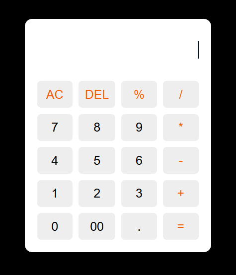

## 🔢 Simple Calculator

A sleek and responsive calculator web application built using **HTML**, **CSS**, and **JavaScript**. This project includes basic arithmetic operations, an all-clear function, and a custom erase (backspace) feature.

---

## 🌟 Features

- ✅ Perform basic operations: Addition, Subtraction, Multiplication, and Division
- ⌫ **Erase button** to remove the last digit
- 🧼 **AC (All Clear)** button to reset the calculator
- 🎯 Responsive design and interactive UI
- 🎨 Styled with modern CSS, including hover effects and custom button colors

---

## 🛠️ Technologies Used

- **HTML** – Structure of the calculator
- **CSS** – Styling, layout, and responsiveness
- **JavaScript** – Logic, interaction, and event handling

---

## 📸 Screenshot

 

---

## 📁 Project Structure

│   ├── 📂 calculator
│   ├── 📂 index.html  # Main HTML file
│   ├── 📂 style.css # CSS styling
│   └── 📂 script.js # JavaScript logic
---

## 🚀 How to Use

1. Clone the repository or download the files:
   ```bash
   git clone https://github.com/yourusername/simple-calculator.git

2. Open index.html in your browser.

🎥 Video Demo
📽️ Watch the video on [here](https://www.linkedin.com/posts/suriya273_webdevelopment-javascript-html-activity-7244543311720386560-kpUp?utm_source=share&utm_medium=member_desktop&rcm=ACoAAE-PMboB_jE9vF6MuQLGY-fso3mMIoTthXA)*

📌 Credits
Project by Suriya D

Internship support by @Internpe

📃 License
This project is open-source and free to use for learning purposes. Give credit where it's due! ✨


